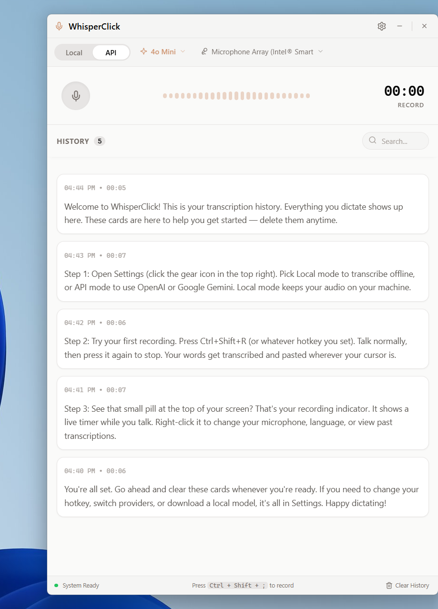
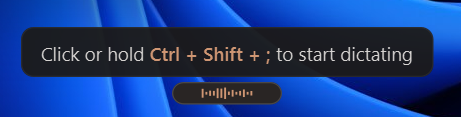
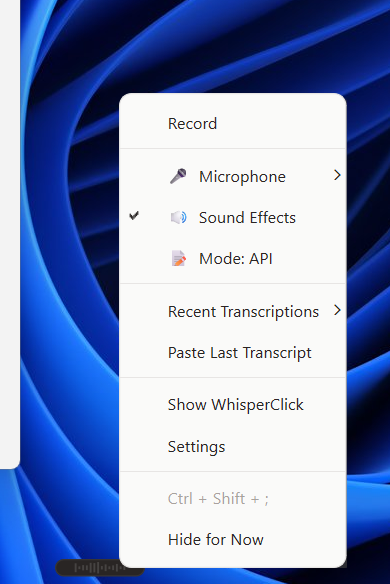

<p align="center">
  
</p>

<h1 align="center">WhisperClick</h1>

<p align="center">
  <strong>Talk instead of type. Anywhere on Windows.</strong><br>
  One hotkey. Instant transcription. Pasted right where your cursor is.
</p>

<p align="center">
  <a href="https://github.com/Zbrooklyn/WhisperClick-Desktop-App/releases/latest">Download for Windows</a>
</p>

---

## What is WhisperClick?

WhisperClick is a desktop speech-to-text app that lives in your system tray. Press a hotkey from any application, say what you're thinking, and the text appears at your cursor. That's it.

It works two ways:

- **Local mode** runs a Whisper AI model directly on your machine. No internet. No data leaves your computer. Ever.
- **API mode** sends audio to OpenAI or Google Gemini for transcription when you want cloud-level accuracy.

You pick the mode. You pick when it listens. There's no always-on microphone and no background recording.

---

## See it in action

<p align="center">
  
</p>

<p align="center">
  
</p>

The floating pill sits at the top of your screen while you record. It shows your hotkey, a live timer, and audio visualization.

<p align="center">
  
</p>

Right-click the system tray icon to switch microphones, change language, or open settings.

<p align="center">
  
</p>

---

## Why WhisperClick?

**You talk 3-4x faster than you type.** WhisperClick closes the gap between thinking and writing.

- **Works in any app.** Email, Slack, Google Docs, your IDE, any text field. One global hotkey triggers recording wherever you are.
- **Runs fully offline.** Local mode uses [faster-whisper](https://github.com/SYSTRAN/faster-whisper) on your hardware. Your audio never leaves your machine.
- **No extra steps.** Press the hotkey, talk, stop. Text appears at your cursor already pasted.
- **50+ languages.** Supports every language Whisper handles.
- **Searchable history.** Every transcription is saved with audio playback so you can find what you said later.
- **Stays out of your way.** Lives in the system tray. A small floating pill shows up only while recording.

---

## Download

Go to the [latest release](https://github.com/Zbrooklyn/WhisperClick-Desktop-App/releases/latest) and grab one of these:

| Download | Best for |
|----------|----------|
| **WhisperClick-Setup-*.exe** | Most users. Installs to your system, adds Start Menu shortcut. |
| **WhisperClick-portable-*.zip** | USB drives, shared machines. Unzip and run, no install. |
| **WhisperClick-portable-onefile-*.exe** | Single file you can drop anywhere and run. |

### Get started in 30 seconds

1. Run the installer or portable EXE
2. WhisperClick appears in your system tray
3. Press `Ctrl+Shift+R` to start recording
4. Talk, then press `Ctrl+Shift+R` again to stop
5. Your words appear as text, pasted at your cursor

### Set up API mode (optional)

1. Right-click the tray icon, open **Settings**
2. Switch to **API** mode, pick OpenAI or Gemini
3. Paste your API key (verified and stored securely in your OS keyring)

### Set up local mode

1. Open **Settings**, switch to **Local** mode
2. Pick a model size (tiny for speed, large for accuracy)
3. Hit **Download** once, then it runs fully offline from that point on

---

## Privacy

We don't collect anything. No telemetry, no analytics, no background network calls.

- **Local mode**: Audio is processed on your machine and never sent anywhere.
- **API mode**: Audio goes to OpenAI or Google only when you press the hotkey. Nothing is stored after transcription.

Full details in [PRIVACY.md](PRIVACY.md).

---

## For Developers

### Run from source

```bash
git clone https://github.com/Zbrooklyn/WhisperClick-Desktop-App.git
cd WhisperClick-Desktop-App

python -m venv venv
venv\Scripts\activate
pip install -r requirements.txt

python src/main.py
```

### Build distributable packages

```powershell
# Folder portable (PyInstaller)
.\release_windows.ps1

# Single-file portable
.\build_windows_onefile.ps1

# Windows installer (requires Inno Setup)
.\build_windows_installer.ps1
```

Full build guide: [docs/WINDOWS_BUILD.md](docs/WINDOWS_BUILD.md)

### Project structure

```
src/
  main.py              # App entrypoint (pywebview + pystray + hotkey + tray)
  pill_manager.py      # Floating pill lifecycle (PySide6)
  pill_widget.py       # Floating pill UI widget
  backend/
    api.py             # Desktop bridge API
    audio_recorder.py  # Audio capture (sounddevice)
    config.py          # Settings and history persistence
    transcription.py   # Transcription engine (OpenAI, Gemini, local Whisper)
  frontend/
    index.html         # Main UI
```

---

## License

WhisperClick is source-available under [CC BY-NC-SA 4.0](https://creativecommons.org/licenses/by-nc-sa/4.0/). Free for personal and community use. Commercial use requires a separate license. See [LICENSE](LICENSE).

## Security

Found a vulnerability? See [SECURITY.md](SECURITY.md) for responsible disclosure.
