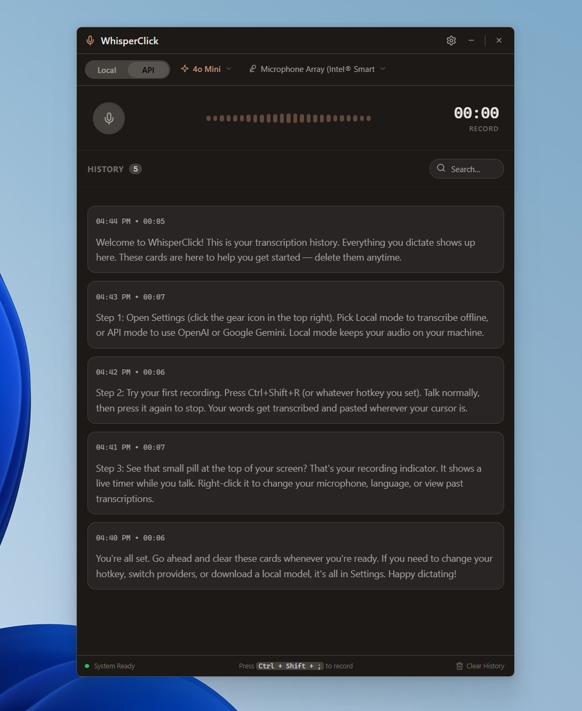
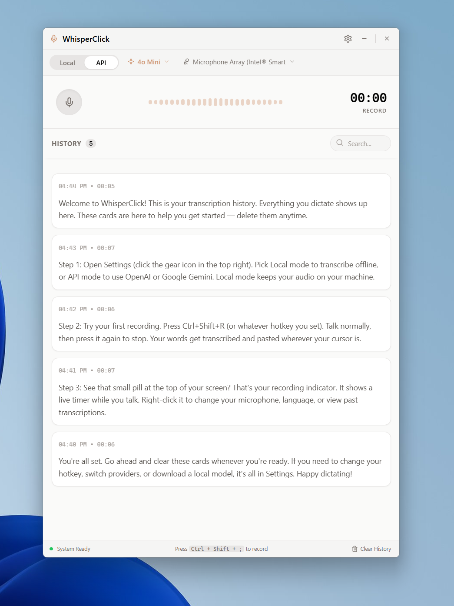

<p align="center">
  
</p>

<h1 align="center">WhisperClick</h1>

<p align="center">
  <strong>Talk instead of type. Anywhere on your desktop.</strong><br>
  One hotkey. Instant transcription. Pasted right where your cursor is.
</p>

<p align="center">
  <a href="https://github.com/Zbrooklyn/WhisperClick-Desktop-App/releases/latest">Download</a> &middot; <a href="https://whisperclick.com">Website</a> &middot; <a href="https://github.com/Zbrooklyn/WhisperClick-Desktop-App/issues">Feedback</a>
</p>

---

You talk 3-4x faster than you type. That speed gap costs you hours every week — in emails, Slack messages, docs, code comments, and every other text field on your screen.

WhisperClick closes that gap. Press a hotkey, say what you're thinking, and the transcribed text appears at your cursor. Done. No copying, no pasting, no switching windows. It works in every app on your desktop.

<p align="center">
  
</p>

## How it works

1. Press **Ctrl+Alt+R** from any app (customizable)
2. Talk naturally
3. Press the hotkey again to stop
4. Text appears at your cursor, already pasted

That's the whole workflow. There's no app to switch to, no text to copy. You talk, it types.

### The floating pill

A small pill sits at the edge of your screen while recording. It shows live audio bars so you know it's listening, and has cancel/stop controls if you need them.

<p align="center">
  
  &nbsp;&nbsp;&nbsp;
  
</p>

Right-click the pill for quick access to history, settings, or to hide it entirely. When you're not recording, it shrinks to a tiny capsule that stays out of your way.

## Download

<table>
  <tr>
    <td><strong>Windows</strong></td>
    <td>
      <a href="https://github.com/Zbrooklyn/WhisperClick-Desktop-App/releases/latest">Setup Installer (.exe)</a><br>
      <a href="https://github.com/Zbrooklyn/WhisperClick-Desktop-App/releases/latest">Portable (.exe)</a>
    </td>
    <td>Fully tested &amp; stable</td>
  </tr>
  <tr>
    <td><strong>macOS</strong></td>
    <td>
      <a href="https://github.com/Zbrooklyn/WhisperClick-Desktop-App/releases/latest">DMG (Apple Silicon)</a> — M1/M2/M3/M4<br>
      <a href="https://github.com/Zbrooklyn/WhisperClick-Desktop-App/releases/latest">DMG (Intel)</a> — 2015–2020 Macs
    </td>
    <td>Early access</td>
  </tr>
  <tr>
    <td><strong>Linux</strong></td>
    <td><a href="https://github.com/Zbrooklyn/WhisperClick-Desktop-App/releases/latest">AppImage</a></td>
    <td>Early access</td>
  </tr>
</table>

All downloads are on the [Releases page](https://github.com/Zbrooklyn/WhisperClick-Desktop-App/releases). The app auto-updates after you install — you only need to download once.

> **macOS and Linux:** Core recording and transcription work on all platforms. Some features like auto-paste and system tray behavior may vary as we continue testing. [Let us know](https://github.com/Zbrooklyn/WhisperClick-Desktop-App/issues) what works and what doesn't — it genuinely helps.

### Getting started

1. Run the installer (or the portable EXE — your choice)
2. WhisperClick opens and walks you through setup
3. Pick a transcription provider and paste your API key
4. Press **Ctrl+Alt+R** and start talking

Setup takes about 60 seconds.

## What you get

- **Global hotkey from any app.** Email, Slack, VS Code, Google Docs, a terminal — wherever your cursor is. One hotkey triggers recording and pastes the result.
- **Auto-paste at cursor.** No clipboard dance. Text lands exactly where you were typing.
- **Floating pill indicator.** Shows recording state and live audio levels. Right-click for history, settings, and quick controls.
- **50+ languages.** Auto-detection, or pick a specific language. Translate on the fly — speak in one language, get text in another.
- **Searchable history.** Every transcription is saved with the original audio for playback. Search, copy, export, or replay anything.
- **Audio visualizer.** 8 visual styles, 3 motion presets, 4 density levels. Make it yours.
- **Dark and light themes.** Follows your system, or set it manually.
- **System tray.** Lives in your tray quietly. Right-click for quick controls, recent transcriptions, and settings.
- **Auto-updates.** New versions download in the background. Click restart when you're ready.

<p align="center">
  
</p>

## Transcription providers

WhisperClick uses cloud APIs for fast, accurate transcription. You'll need an API key from one of these providers:

| Provider | What you get | Get a key |
|----------|-------------|-----------|
| **OpenAI** | GPT-4o Transcribe, GPT-4o Mini Transcribe, Whisper | [platform.openai.com/api-keys](https://platform.openai.com/api-keys) |
| **Google Gemini** | Gemini 2.5 Flash, 2.5 Pro, and newer models | [aistudio.google.com/apikey](https://aistudio.google.com/apikey) |

Both providers offer free tiers or low-cost usage. A typical user's monthly cost is under $1.

Your API key is encrypted at rest using your operating system's secure keychain — never stored in plain text.

## Privacy

No telemetry. No analytics. No background network calls. No data collection of any kind.

- Audio goes to your chosen provider **only** when you press the hotkey. Nothing is sent otherwise.
- Nothing is stored on any server after transcription returns.
- There is no always-on microphone. Recording starts when you press the hotkey and stops when you press it again.

You pick when it listens. Full details in [PRIVACY.md](PRIVACY.md).

---

## For developers

<details>
<summary>Build from source, run tests, architecture overview</summary>

### Build from source

```bash
git clone https://github.com/Zbrooklyn/WhisperClick-Desktop-App.git
cd WhisperClick-Desktop-App
npm install
pip install -r shared/engine/requirements.txt
npm start
```

### Build installers

```bash
npm run dist:win     # Windows (NSIS + portable)
npm run dist:mac     # macOS (DMG)
npm run dist:linux   # Linux (AppImage)
```

### Run tests

```bash
# Electron (Jest)
npm test             # 412 tests
npm run test:unit    # Unit tests
npm run test:e2e     # End-to-end tests

# Tauri (Rust)
cd platforms/tauri && cargo test   # 518 tests
```

### How it's built

WhisperClick is a desktop app with a Python sidecar that handles audio recording and transcription. The frontend is a single HTML file with Tailwind CSS — no React, no build step, no framework overhead. It ships on two platforms: **Electron** (stable, current releases) and **Tauri** (Rust-based, lighter footprint).

```
platforms/electron/    Electron main process (Node.js)
  main.js              Window management, IPC, hotkey, tray
  sidecar.js           Python engine manager (JSON over stdin/stdout)
  store.js             Settings and history persistence
  updater.js           Auto-update (GitHub releases)

platforms/tauri/       Tauri platform (Rust + WebView)
  src-tauri/           Rust backend (commands, sidecar bridge, tray)
  src/                 Tauri-specific frontend wiring

shared/frontend/       Renderer (shared across platforms)
  index.html           Full UI (HTML + Tailwind CSS + inline JS)

shared/pill/           Floating widget (shared)
  pill.html            Always-on-top recording capsule

shared/engine/         Python sidecar
  engine.py            Audio capture, transcription, model management
```

</details>

## Feedback and bugs

Found something broken? Have an idea? [Open an issue](https://github.com/Zbrooklyn/WhisperClick-Desktop-App/issues). We read every one.

## License

Source-available under [CC BY-NC-SA 4.0](LICENSE). Free for personal and non-commercial use.

## Security

Found a vulnerability? See [SECURITY.md](SECURITY.md) for responsible disclosure.
